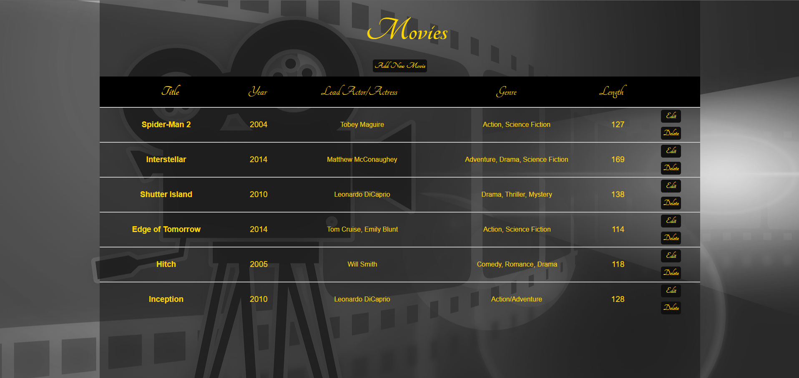

# Movies Info Database Web Application

Stores small collection of data for any movie that is input into the database and can display it in the feed on screen. Utilized JavaScript, HTML, CSS, along with Python and SQLite.

**Movies**

Attributes:

* title (string)
* year (integer)
* lead_actor (string)
* genre (string)
* duration (string)

## Schema

```sql
CREATE TABLE movies (
id INTEGER PRIMARY KEY,
title TEXT,
year INTEGER,
lead_actor TEXT,
genre TEXT,
duration INTEGER);
```

## REST Endpoints

Name                        | Method | Path
----------------------------|--------|-----------------
retrieve_movies_collection  | GET    | /movies
retrieve_movies_member      | GET    | /movies/*\<id\>*
delete_movies_member        | DELETE | /movies/*\<id\>*
create_in_movies_collection | POST   | /movies
update_movie_member         | PUT    | /movies/*\<id\>*


